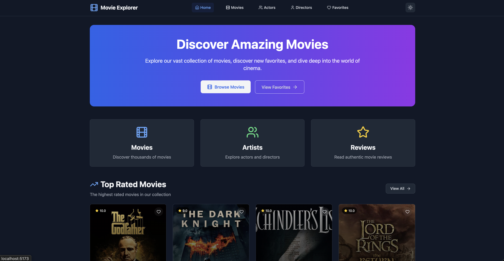
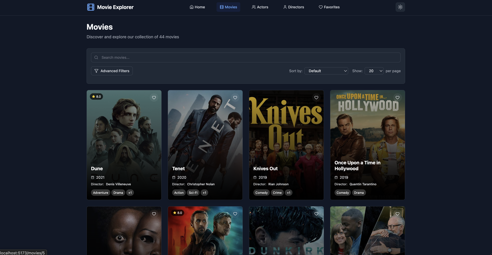
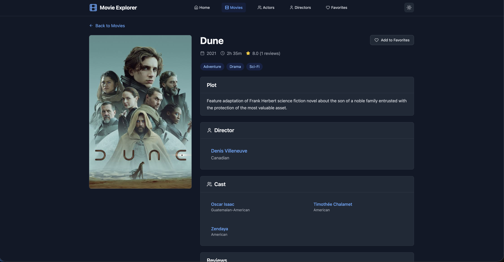
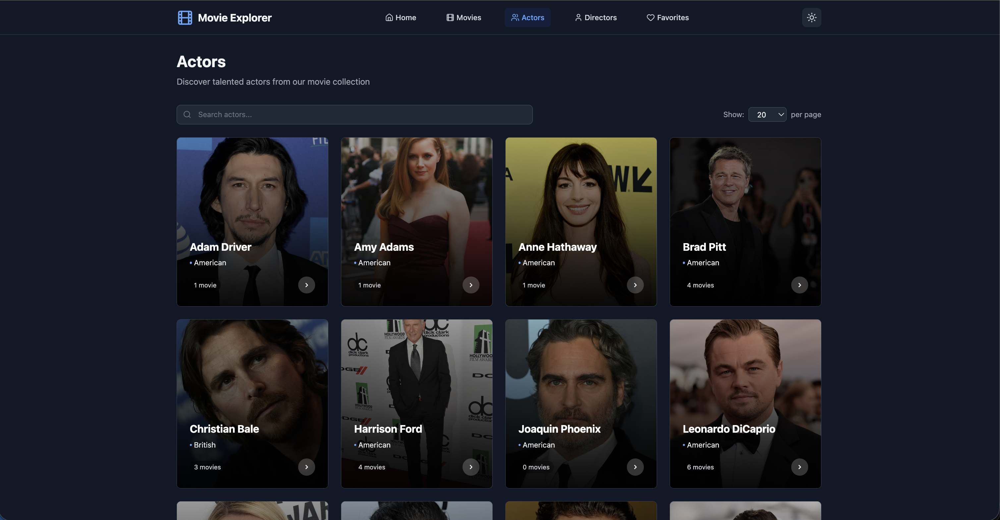
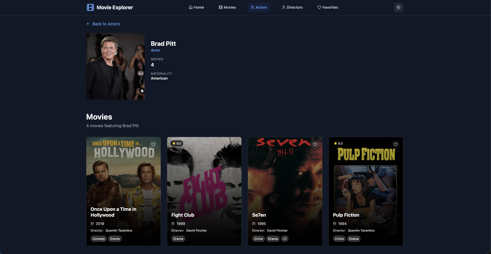
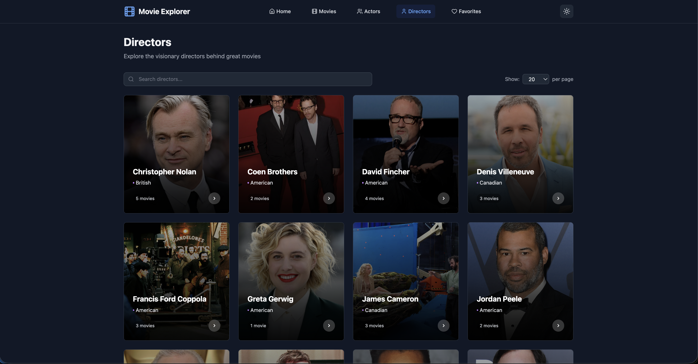
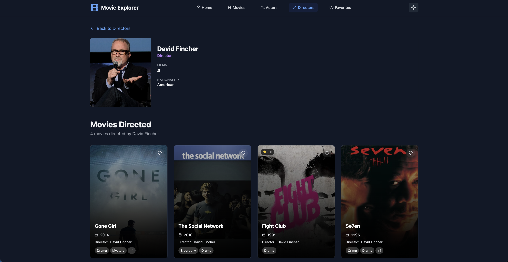
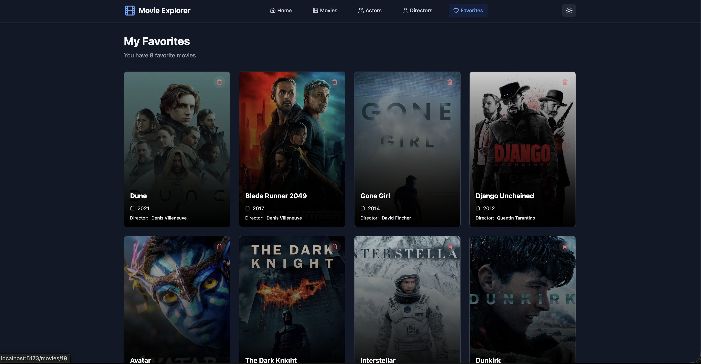

# Movie Explorer

A full-stack movie exploration application built with Django REST Framework backend and React TypeScript frontend. Discover movies, actors, directors, and manage your favorite films with advanced filtering and search capabilities.

## Features

- **Movie Discovery**: Browse and search through an extensive movie database
- **Advanced Filtering**: Filter by genre, year, rating, director, and actors
- **Detailed Information**: View comprehensive details about movies, actors, and directors
- **Favorites System**: Save and manage your favorite movies
- **Responsive Design**: Optimized for desktop and mobile devices
- **Dark/Light Theme**: Toggle between themes for better user experience
- **Real-time Search**: Instant search results with debounced queries
- **Pagination**: Efficient browsing with customizable page sizes

## Prerequisites

- **Node.js** 20+ and npm/yarn
- **Python** 3.11+
- **PostgreSQL** 15+
- **Docker** and Docker Compose (optional, recommended)

## Local Development Setup

### Docker Compose

#### Development Environment

1. **Clone the repository**

   ```bash
   git clone <repository-url>
   cd movie-explorer-assignment
   ```
2. **Start the development environment**

   ```bash
   docker compose run backend python manage.py migrate
   docker compose up

   ```
3. **Access the applications**

   - Frontend: http://localhost:3000
   - Backend API: http://localhost:8000/api/
   - API Documentation: http://localhost:8000/api/docs/
   - Admin Panel: http://localhost:8000/admin/
4. **Create superuser (optional) (Required for admin page login)**

   ```bash
   docker compose run backend python manage.py createsuperuser
   ```
5. **Load sample data (optional)**

   ```bash
   docker compose run backend python manage.py load_sample_data
   ```

#### Screenshots

### Home Page



### Movies Page



### Movie Detail Page



### Actors Page



### Actor Detail Page



### Directors Page



### Director Detail Page



### Favorites Page



## Architecture

### Backend (Django REST Framework)

- **API Endpoints**: RESTful API with comprehensive CRUD operations
- **Database**: PostgreSQL with optimized queries
- **Authentication**: Django admin authentication
- **Documentation**: Auto-generated Swagger/OpenAPI docs
- **Filtering**: Advanced filtering with django-filter
- **Pagination**: Efficient pagination for large datasets

### Frontend (React TypeScript)

- **State Management**: React Query for server state, Context API for client state
- **Routing**: React Router for navigation
- **Styling**: Tailwind CSS with dark/light theme support
- **Components**: Reusable component library
- **Type Safety**: Full TypeScript implementation
- **Performance**: Optimized with lazy loading and caching

## API Endpoints

### Movies

- `GET /api/movies/` - List movies with filtering
- `GET /api/movies/{id}/` - Movie details
- `GET /api/movies/by_genre/?name={genre}` - Movies by genre
- `GET /api/movies/top_rated/` - Top rated movies

### Actors

- `GET /api/actors/` - List actors
- `GET /api/actors/{id}/` - Actor details with movies

### Directors

- `GET /api/directors/` - List directors
- `GET /api/directors/{id}/` - Director details with movies

### Reviews

- `GET /api/reviews/` - List reviews
- `GET /api/reviews/featured/` - Featured reviews

## Links

- **Frontend Repository**: `./movie-explorer-frontend`
- **Backend Repository**: `./movie-explorer-backend`
- **API Documentation**: http://localhost:8000/api/docs/
